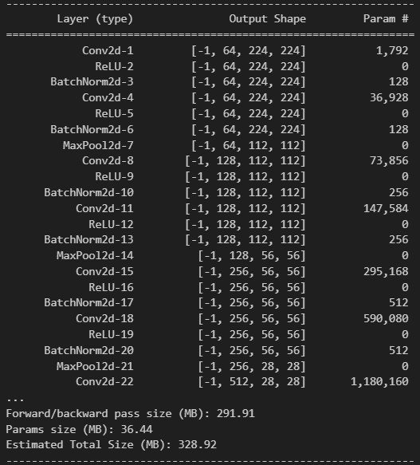
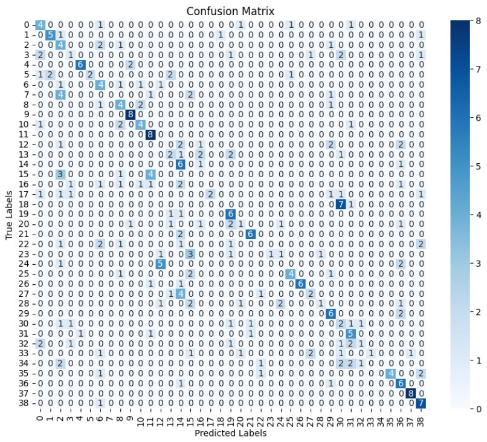

# PlantDiseaseClassifier

A deep learning-based project for classifying plant diseases using convolutional neural networks (CNNs). This repository includes code for data processing, model training, and evaluation.

## Table of Contents
- [Overview](#overview)
- [Dataset](#dataset)
- [Model Architecture](#model-architecture)
- [Installation](#installation)
- [Usage](#usage)
- [Results](#results)
- [Contributing](#contributing)
- [Contact](#contact)

## Overview
PlantDiseaseClassifier is designed to classify plant diseases from images. It uses a convolutional neural network (CNN) to learn and predict diseases in various plants, improving agricultural practices by enabling early and accurate disease detection.

## Dataset
The dataset used in this project consists of images of leaves categorized into different disease classes. In this dataset, 39 different classes of plant leaf images are available, containing a total of 61,486 images. For training the model, we randomly choose 40 images (you can change the number in the code provided in the `data` folder) from each class, making the training set balanced and manageable.

You can download the dataset from the following link:
[Dataset](https://data.mendeley.com/datasets/tywbtsjrjv/1)

## Model Architecture
The model is built using PyTorch and consists of multiple convolutional layers followed by fully connected layers. Batch normalization and dropout are used to improve the performance and generalization of the model.

Here is the summary of the model:



## Installation
To run this project, ensure you have Python 3.8+ and the following libraries installed:

- PyTorch
- torchvision
- scikit-learn
- matplotlib
- numpy
- pandas
- jupyter

Install the dependencies using:
```bash
pip install -r requirements.txt
```

## Usage
1. Download the dataset from the provided link above.

2. Prepare the dataset using the provided Python file in the data folder.

3. Use the provided Jupyter notebook to process data, train the model, and save the model. You can also find individual scripts in the src folder.

4. Evaluate the model performance on the test set using the given script.

To run python files, you can follow this pattern:
```bash
python src/file_name.py
```

## Results
After training the model, the performance metrics and results will be displayed, including the training and validation accuracy, as well as test accuracy.

Below is the model's performance:

Accuracy: 40.71%

Confusion Matrix: 


## Contributing
Contributions are welcome! Please open an issue or submit a pull request for any feature requests, bug fixes, or improvements.

## Contact
For any questions or feedback, please contact:

Jay Dobariya
dobariyajay2004@gmail.com